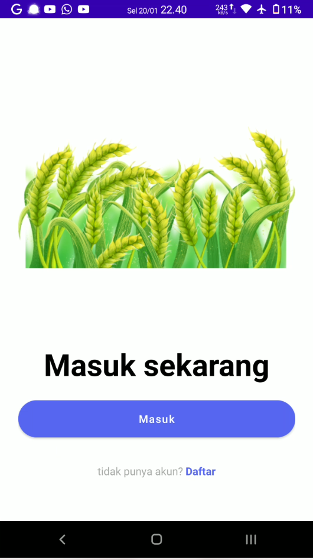
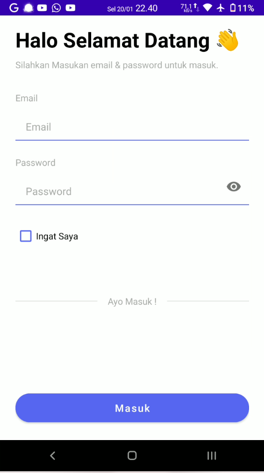
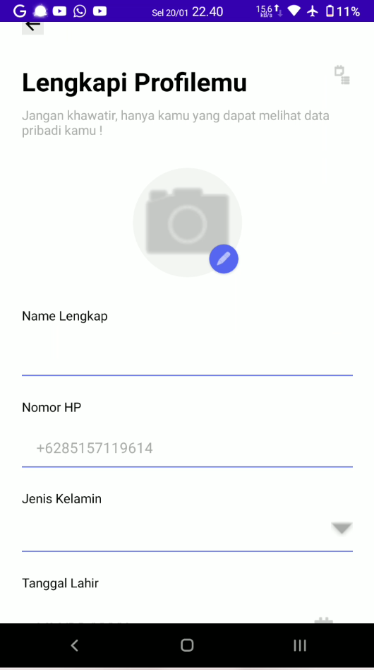
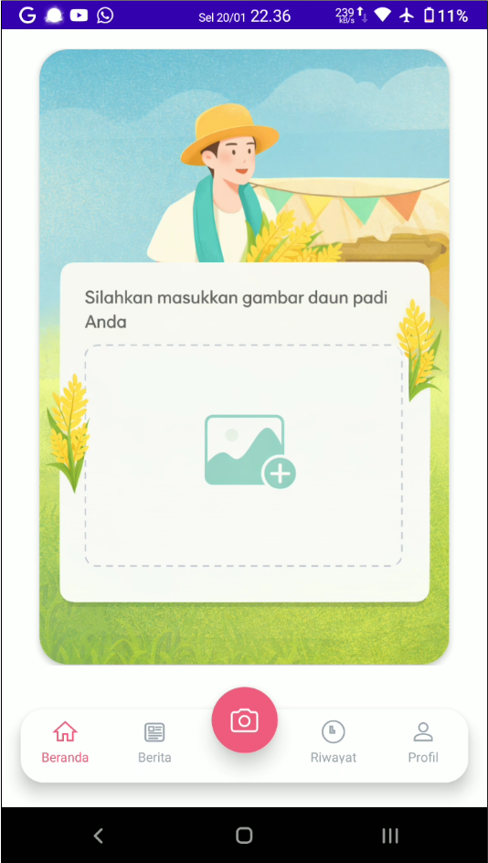
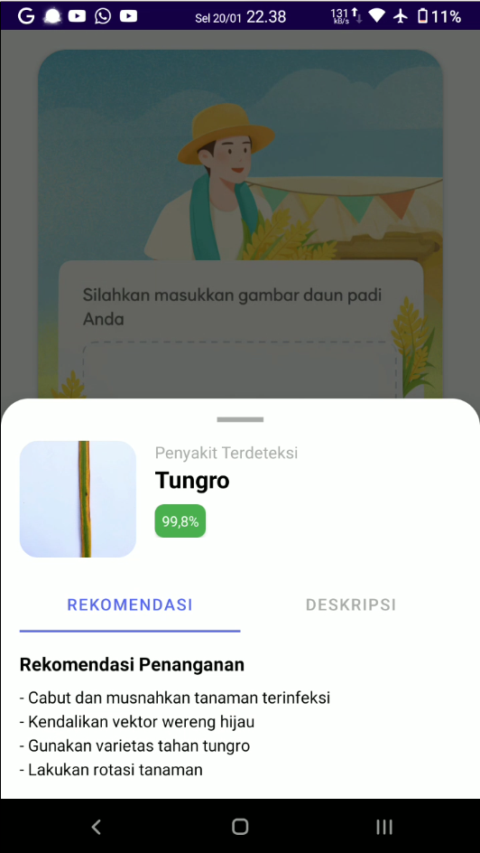
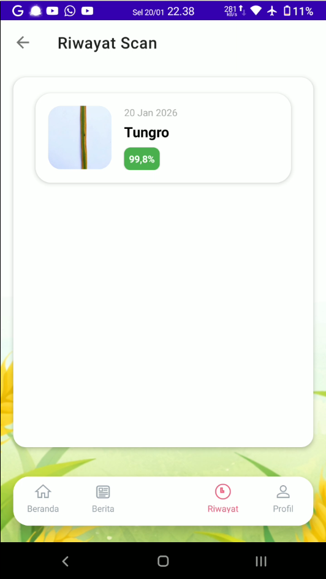
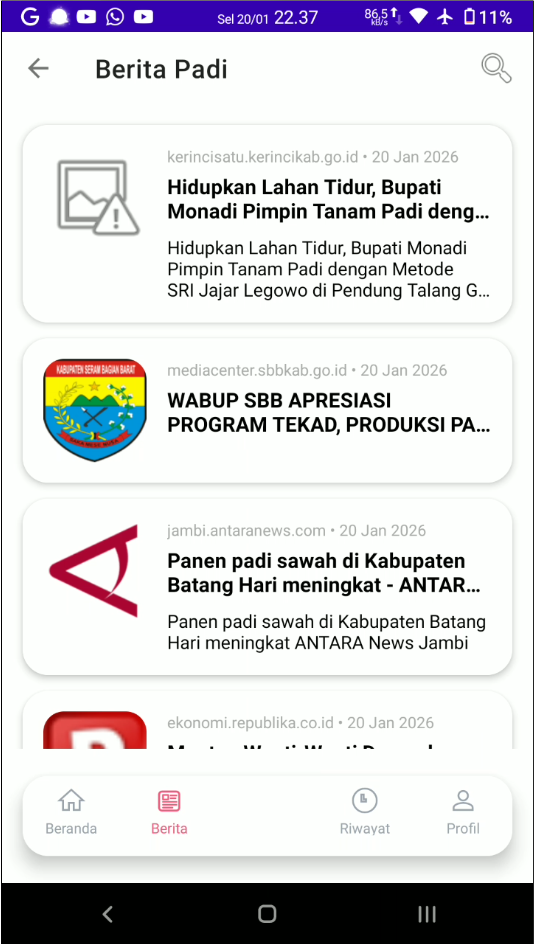

Deskripsi

Deteksi Penyakit Daun Padi adalah aplikasi mobile berbasis Android yang membantu petani dan ahli pertanian untuk mengidentifikasi penyakit pada tanaman padi secara cepat dan akurat. Aplikasi ini menggunakan model Deep Learning MobileNetV2 yang telah dilatih untuk mendeteksi berbagai jenis penyakit daun padi melalui analisis gambar.

 Penyakit yang Dapat Dideteksi

1. Blast - Penyakit blas (Pyricularia oryzae)
2. Blight - Penyakit hawar (Bacterial leaf blight)
3. Tungro - Penyakit tungro (Rice tungro disease)
4. Normal - Daun sehat/normal

---

 Fitur

 Deteksi Cerdas
- Klasifikasi Multi-Kelas - Mendeteksi 4 kategori kondisi daun padi
- Confidence Score - Menampilkan tingkat kepercayaan prediksi (akurasi)
- Multi-Layer Filtering - Validasi gambar berlapis untuk akurasi tinggi:
  - ✅ Confidence threshold filtering
  - ✅ Ambiguity detection
  - ✅ Blank/uniform image detection
  - ✅ Leaf contour validation
  - ✅ Color histogram analysis

 Input Fleksibel
- Kamera Langsung - Ambil foto daun secara real-time
- Galeri - Upload foto dari penyimpanan perangkat
- Auto Validation - Sistem otomatis memvalidasi apakah gambar adalah daun padi

 Rekomendasi Tindakan
- Saran perawatan spesifik untuk setiap jenis penyakit
- Panduan praktis untuk petani
- Informasi tindakan pencegahan

 Riwayat Deteksi
- Simpan hasil deteksi secara otomatis
- Lihat riwayat deteksi sebelumnya
- Detail lengkap: gambar, hasil, confidence score, dan tanggal

 Berita Pertanian AI
- Artikel terkini tentang pertanian dan teknologi
- RSS feed terintegrasi dengan AI untuk berita pertanian
- Baca dalam aplikasi dengan tampilan nyaman

Manajemen Akun
- Sistem login dan registrasi
- Profil pengguna yang dapat dikustomisasi
- Keamanan data dengan session management

 UI/UX Modern
- Desain material design yang elegan
- Bottom navigation dengan FAB (Floating Action Button)
- Smooth animations dan transitions
- Dark mode support
- Responsive layout

 Teknologi yang Digunakan

 Core Technologies
- Language : Java
- Platform : Android (API 24+)
- Build System : Gradle (Kotlin DSL)
- Min SDK : 24 (Android 7.0)
- Target SDK : 34 (Android 14)

 Machine Learning
- Framework : TensorFlow Lite
- Model : MobileNetV2 (Optimized for mobile)
- Input Size : 224x224 pixels
- Preprocessing : Normalization (-1 to 1 range)

Android Libraries
```gradle
- AndroidX Core KTX
- AndroidX AppCompat
- Material Design Components
- ConstraintLayout
- CardView
- SwipeRefreshLayout
- TensorFlow Lite (+ Support & Metadata)
- Glide (Image loading)
```

 Database
- SQLite  - Local database untuk menyimpan riwayat deteksi dan data pengguna

---

📱 Screenshot Aplikasi
<p align="center">     </p> <p align="center">     </p>

 Instalasi

Prerequisites
- Android Studio Arctic Fox atau lebih baru
- JDK 11 atau lebih tinggi
- Android SDK dengan API level 24+
- Gradle 7.0+

Langkah Instalasi

1. **Clone Repository**
   ```bash
   git clone https://github.com/ekosaputro45/Deteksi-Penyakit-Daun-Padi-Berbasis-Android-Menggunakan-Model-MobileNetV2.git
   cd Deteksi-Penyakit-Daun-Padi-Berbasis-Android-Menggunakan-Model-MobileNetV2
   ```

2. **Buka di Android Studio**
   - Buka Android Studio
   - Pilih "Open an Existing Project"
   - Navigasi ke folder project dan pilih

3. **Sync Gradle**
   - Android Studio akan otomatis melakukan sync
   - Tunggu hingga proses selesai

4. **Build Project**
   ```bash
   ./gradlew build
   ```

5. **Run Application**
   - Hubungkan perangkat Android atau jalankan emulator
   - Klik tombol "Run" di Android Studio
   - Atau via command line:
   ```bash
   ./gradlew installDebug
   ```

---

 Cara Penggunaan

 1. Deteksi via Kamera
1. Buka aplikasi
2. Tap tombol FAB (Floating Action Button) di tengah bawah
3. Arahkan kamera ke daun padi
4. Ambil foto
5. Tunggu proses deteksi
6. Lihat hasil dan rekomendasi

 2. Deteksi via Galeri
1. Buka aplikasi
2. Tap card "Product Scanner" atau icon galeri di bottom navigation
3. Pilih foto dari galeri
4. Tunggu proses deteksi
5. Lihat hasil dan rekomendasi

 3. Melihat Riwayat
1. Tap icon "History" di bottom navigation
2. Browse semua deteksi sebelumnya
3. Tap item untuk melihat detail

 4. Membaca Berita Pertanian
1. Tap icon "News" di bottom navigation
2. Browse artikel terkini
3. Tap artikel untuk membaca detail

---


## 📊 Model Information

### MobileNetV2 Details
- **Architecture**: MobileNetV2 (Lightweight CNN)
- **Input Shape**: `[1, 224, 224, 3]`
- **Output Shape**: `[1, 4]` (4 classes)
- **Normalization**: Pixel values scaled to [-1, 1]
- **Format**: TensorFlow Lite (.tflite)
- **Size**: ~14 MB (optimized)

### Training Dataset
Dataset terdiri dari gambar daun padi dalam berbagai kondisi:
- ✅ Kondisi pencahayaan berbeda
- ✅ Berbagai sudut pengambilan gambar
- ✅ Background yang beragam
- ✅ Tingkat keparahan penyakit yang berbeda

---

## 🔐 Permissions

Aplikasi memerlukan permission berikut:
```xml
<uses-permission android:name="android.permission.CAMERA" />
<uses-permission android:name="android.permission.READ_EXTERNAL_STORAGE" />
<uses-permission android:name="android.permission.WRITE_EXTERNAL_STORAGE" />
<uses-permission android:name="android.permission.INTERNET" />
```

---

## 🐛 Known Issues

- [ ] Camera preview orientation di beberapa device
- [ ] Performa di device low-end (<2GB RAM)

---

## 🗺 Roadmap

- [ ] Tambah support untuk lebih banyak penyakit padi
- [ ] Implementasi offline mode penuh
- [ ] Export hasil deteksi ke PDF
- [ ] Multi-language support (English, etc.)
- [ ] Integration dengan IoT sensors
- [ ] Cloud backup untuk riwayat


👤 Author

Eko Saputro (23215050)
Universitas Harkat Negeri
Program Studi Teknik Informatika
